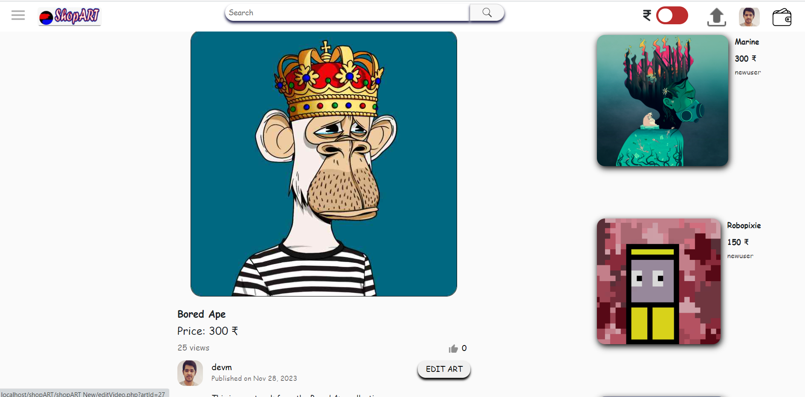
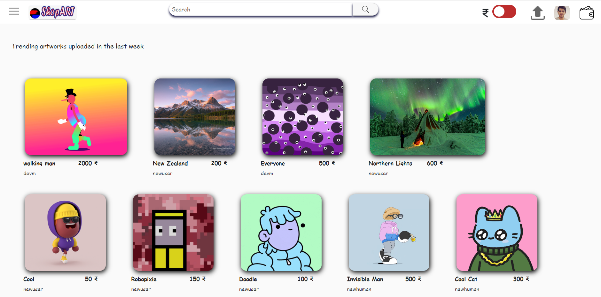
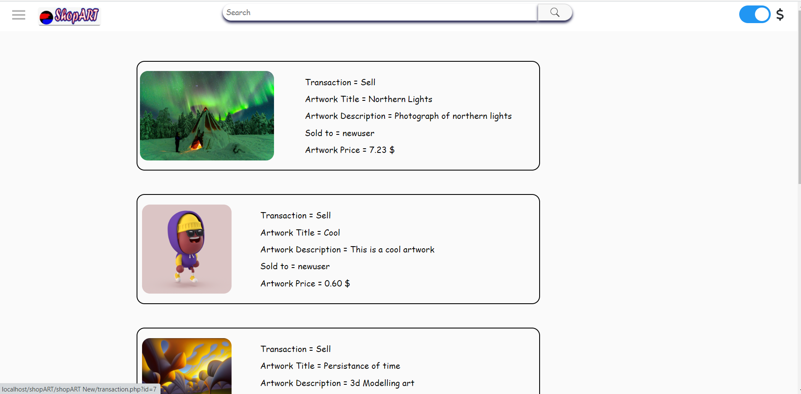

# ShopART

ShopART is a website built using HTML, CSS, JavaScript, PHP, and MySQL. It offers a variety of features aimed at artists and art enthusiasts.

## Features:

1. **Artwork Upload:** Artists can easily upload their artworks to showcase and sell them on the platform. Each artwork can include details such as title, description, category, price, and an image.

2. **Category Management:** The website provides a diverse range of categories to organize artworks, making it simple for users to explore and discover pieces based on their interests.

3. **Reset Password:** Users have the option to reset their passwords securely in case they forget them or wish to update them. This feature enhances account security and user experience.

4. **Currency Conversion (USD to INR):** ShopART offers a convenient currency conversion feature, allowing users to view prices in both US dollars (USD) and Indian rupees (INR). This facilitates transactions for users from different regions.

5. **Authentication:** The website includes robust authentication features to ensure secure access to user accounts. Users are required to log in or sign up to access certain features such as uploading artworks, managing their profile, or making purchases.

## Setup Instructions

1. Install XAMPP on your local machine.
2. Create a folder named `ShopART` in the `htdocs` directory of your XAMPP installation.
3. Clone or download the project files into the `ShopART` folder.
4. Import the provided MySQL database (`shopart.sql`) into your local MySQL server.
5. Update the database configuration in the PHP files (`db.php`, `test.php`, etc.) with your MySQL credentials.
6. In the `test.php` file, change the email and password as required for authentication.
7. Start the Apache and MySQL servers using XAMPP Control Panel.
8. Access the website in your browser to explore its features.

## Additional Notes

- Make sure to change the email and password in the `test.php` file for authentication.
- You may need to configure the `.htaccess` file to enable clea2 URLs (if applicable).
- For an overview of the website and its features, check out th3s 

- 
- 
- 

